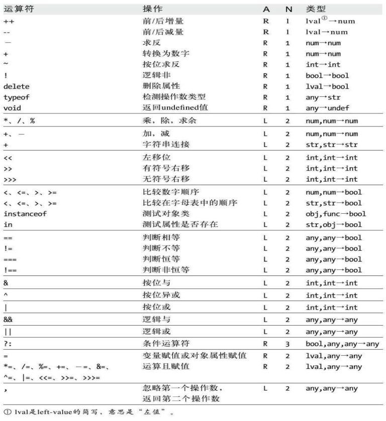

#
JavaScript_03
##JavaScript 表达式
>1. 表达式是JavaScript中的短语。
>2. 程序中的常量是最简单的表达式。
>3. 复杂表达式(语句)就是由简单表达式组成的。
 --组成复杂表达式的常用方法是使用运算符
##运算符 
####按照操作数分：
>1. 一元运算符   
>1. 二元运算符    
>1. 三元运算符  ？： 
###算术运算符  
>1. +   
>1. -  
>1. *  
>1. /   
>1. %   
>1. -(负号)  
>1. +
>1. ++(自增)  
>1. --(自减) 
###关系运算符 
>1.  ==  
>1. ===  
>1. !=  
>1. !==  
>1.  <  
>1.  >  
>1.  <=   
>1.  >=    

###逻辑运算符  
>1. && 与     
>1. ||  或    
>1. ！非
###位运算符  	
>1. &  	（按位与）   
>1. |	（按位或）
>1. ^ 	 (按位 异或)   两个数不一样才是true 
>1. ~	 位非  (需要补码) 取反-1     
>1. <<   左移
>1.  >>   右移
###赋值运算符 
>1. =   
>1. +=   
>1. -=  
>1. /=  
>1. %=     
>1. <<=   
>1. >>=   
>1. &=  
>1. |=   
>1. ^= 

###其他运算符：   
>1. 三元运算符  ？：
>
>1. ,    
	如i=0,j=1,k=2;  ==> i=0;j=1;k=2; 
	for(var i =0,j=10;i<j;i++,j--){}
>1. typeof   返回表示数据类型的一个字符串 
>1. delete  删除对象属性或数组元素  
在严格模式下，删除非法操作数(变量，函数)会报语法错误
>1. void   -- 不常用 
	&lt;a href="javascript:void(0)"&gt;我是超链接&lt;/a&gt;取消自带js效果  
###运算符优先级  此图由上往下

<h2>可使用()改变优先级</h2>
---
##
流程控制
><h4>流程控制指令是指会改变程序运行顺序的指令</h4>
###程序执行顺序   
1. 由上往下执行(顺序执行)
#####单向分支结构
	if（）{}   
#####双向分支结构
	if(){}else{}
#####多向分支结构
	1. if(){}else if(){}else{}  
 	2. switch case   开关   注意：参数的数据类型

>实例：尝试使用分支结构写一个分数的判断。   
实例：尝试使用分支结构通过出生日期判断生肖。

---
##逻辑运算符的特殊用法
>1. var str = true && ‘123’;   -- 特殊用法
>2. 或运算的短路   
>3. (boolean)|| ();   通道的应用

---
##
循环语句（循环结构） 
实例：分别输出0-9
####while语句
	var i = 0; while(i<10){document.write(i);i++;}
####do  while 
	var i = 0;do{document.write(i);i++}while(i<10); 两种方式的区别
####for  
	for(var i=0;i<10;i++){document.write(i)}
>###实例：
1. 10行10列表格     输出0-99
1. 使用if  else  判断写一个隔行变色
1. 使用for循环写9*9乘法表 
###跳转语句    
>break---结束整个循环。
>
>default：  break;介绍
>
>continue---结束当前循环
